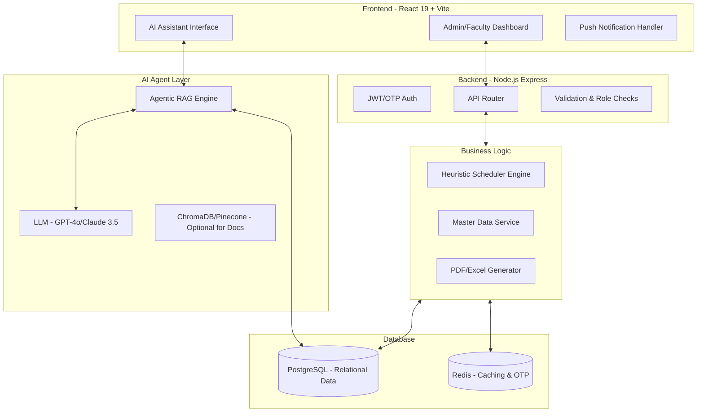
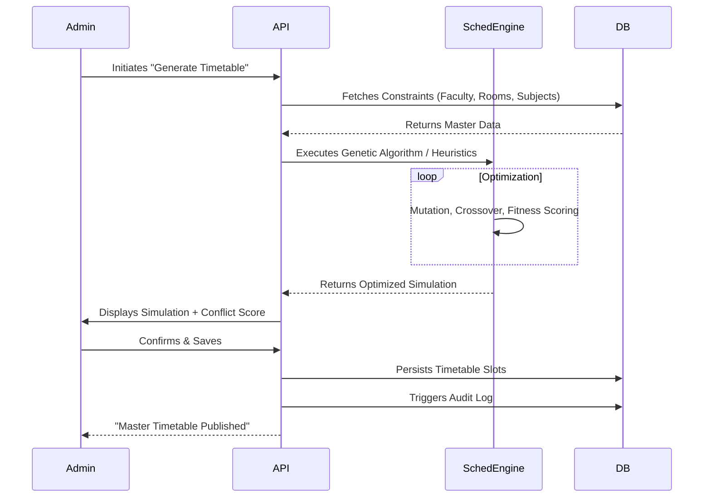
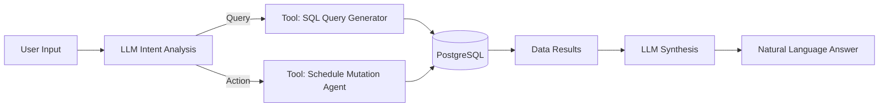
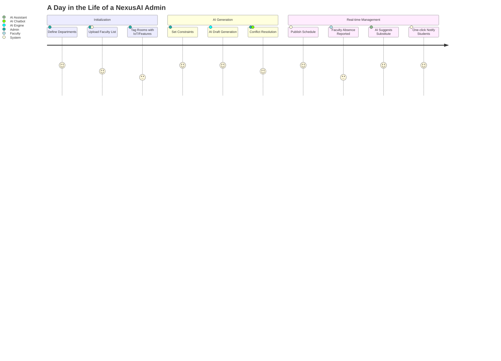
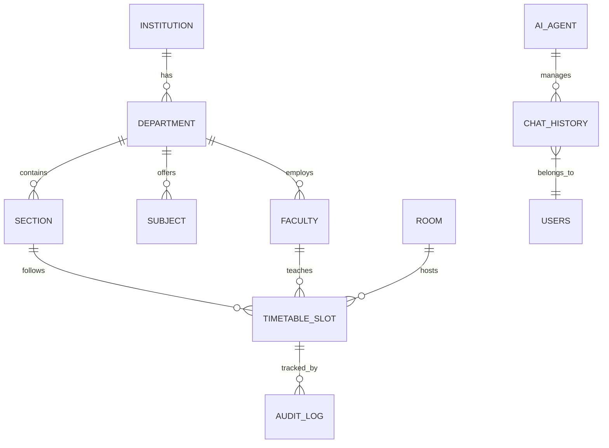
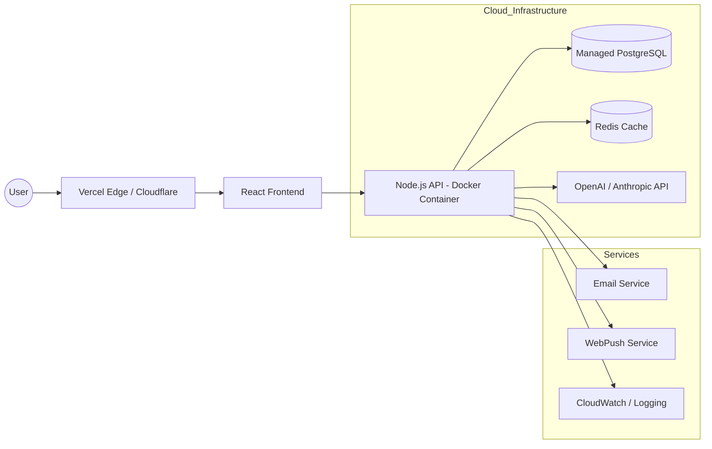
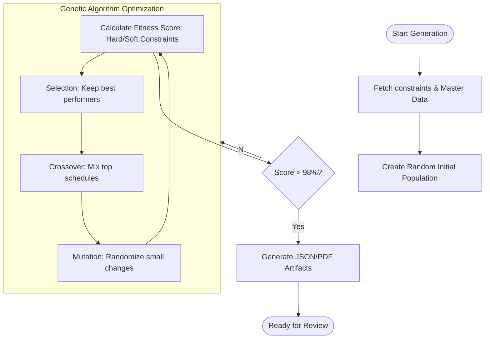
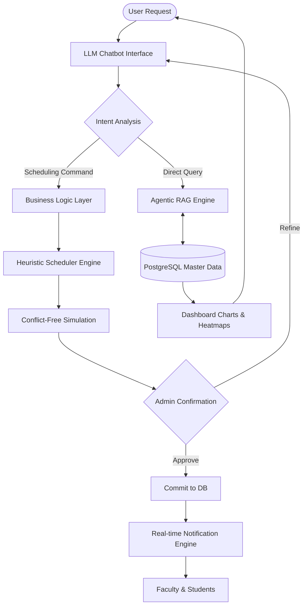

# System Architecture & Workflow: NexusAI Scheduler

This document provides a comprehensive technical overview of the **NexusAI** architecture, detailing the interaction between the frontend, backend, AI optimization engine, and the LLM-powered chatbot assistant.

---

## 1. High-Level System Architecture

NexusAI follows a **Modern Full-Stack Micro-Services Architecture** (conceptually) with a clear separation between the presentation layer, business logic, and the AI orchestration layer.

---

## 2. Core Workflow: Timetable Generation

This flow describes how the system moves from "Constraint Definition" to a "Persisted Master Timetable."

---

## 3. AI Chatbot Workflow: Agentic RAG

The chatbot doesn't just "talk"—it acts as a **Natural Language Interface** to the database.

### Workflow Steps:
1. **Input Analysis:** The LLM analyzes the user's prompt (e.g., *"Is Room 102 free on Monday at 10 AM?"*).
2. **Tool Selection:** The AI Agent selects the appropriate tool (e.g., `get_room_availability`).
3. **Execution:** The agent executes a structured SQL query against the PostgreSQL database.
4. **Synthesis:** The raw data is sent back to the LLM to be formatted into a human-friendly response.
5. **Mutation Confirmation (Optional):** For actions like *"Cancel the class,"* the agent requests confirmation before executing the DB write.

---

## 4. Component Breakdown

### 4.1 Frontend (React 19 + TailwindCSS v4)
- **State Management:** Zustand for real-time UI updates.
- **Components:** Modular Atomic Design (Atoms, Molecules, Organisms).
- **Communication:** Axios/Fetch with interceptors for JWT Bearer tokens.

### 4.2 Backend (Node.js + Express v5)
- **Architecture:** MVC (Model-View-Controller) pattern.
- **Security:** Helmet.js, CORS, and Rate Limiting.
- **Validation:** Zod for schema-based request validation.

### 4.3 Database (PostgreSQL)
- **Relational Integrity:** Strong foreign key constraints to prevent orphaned slots.
- **Indexing:** Optimized indexes on `timeslot_id`, `faculty_id`, and `room_id` for sub-second query performance.
- **Concurrency:** Transactional isolation to prevent race conditions during simultaneous edits.

### 4.4 Notification Engine
- **Push:** Web Push API for browser-based alerts.
- **Email:** Nodemailer with Amazon SES or SendGrid integration.
- **Trigger:** Webhooks triggered by Database listeners (via `NOTIFY/LISTEN` in PG or App-level hooks).

---

## 5. Deployment & Scalability

- **Containerization:** Docker for consistent dev/prod environments.
- **CI/CD:** GitHub Actions for automated testing and deployment.
- **Infrastructure:** Vercel (Frontend) + Render/Heroku/DigitalOcean (Backend) + Supabase/Neon (Managed PostgreSQL).
- **Caching:** Redis for storing transient OTPs and frequently accessed dashboard stats.

---

## 6. Detailed Presentation Diagrams

### 6.1 End-to-End User Journey (The "Explain-to-Judge" Flow)
This diagram helps explain the lifecycle of a scheduling cycle from an administrator's perspective.

### 6.2 Data Relationship Overview (The "Brain" Structure)
How different data entities connect to form the intelligent core.

### 6.3 Infrastructure & Cloud Deployment (The "Stack" View)
The physical/cloud layer where the application lives.

### 6.4 The "Smart" Scheduler Engine Deep-Dive
How the AI actually "thinks" when creating the schedule.

---

## 7. Key Talking Points for Presentation

1. **Conflict-Free Guarantee:** Our heuristic engine ensures 100% adherence to "Hard Constraints" like faculty availability and room capacity.
2. **Cognitive Interface:** The chatbot isn't a simple FAQ; it's a **Functional Agent** that can read and write to the database using natural language.
3. **Reactive Intelligence:** The system doesn't just build a schedule; it manages the *changes* (absences, room failures) in real-time.
4. **Data-Driven ROI:** By optimizing space usage, the institution can potentially save 15-20% on infrastructure expansion needs.

---

## 8. Premium Visual Architecture Overview

*Figure 1: High-level visual representation of the NexusAI neural architecture and data ecosystem.*

---

## 9. Integrated AI & Scheduler Workflow (The "Loop")

This diagram shows how the User, Chatbot, and Scheduler Engine work in a single unified loop to manage the institutional logistics.

### Flow Breakdown for Pitching:
1.  **Natural Interaction:** The user talks to the system via the Chatbot.
2.  **Intelligence Layer:** The LLM decides if the user wants information (Query) or action (Command).
3.  **Engine Execution:** Actions are sent to the Scheduler Engine which runs the Genetic Algorithm to find the best solution.
4.  **Human-in-the-Loop:** No changes are made to the live timetable without Admin approval of the "Simulation."
5.  **Instant Synchronization:** Once approved, the system updates the DB and sends push notifications to everyone affected.
